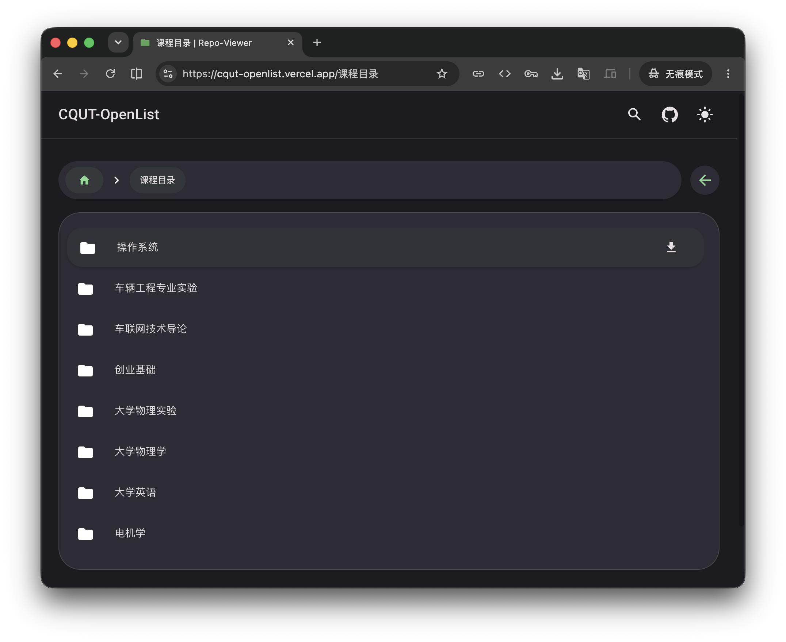

# Repo-Viewer

基于 Material Design 3设计风格的 GitHub仓库浏览应用

## 主要功能

- 📁 **仓库浏览**：直观的文件结构导航，同时提供首页文件与文件夹排除选项
- 🔎 **文件搜索**：基于 GitHub Code Search API 的快速搜索（内容 + 路径），可按分支、路径前缀和扩展名过滤
- 📄 **文件预览**：多种文件格式预览，目前支持 `Markdown`、 `PDF` 和 `图片`
- ⬇️ **文件下载**：可下载单个文件或整个文件夹

## 部署指南

> [!IMPORTANT]
> 本项目深度适配 Vercel，强烈推荐使用 Vercel 部署

### 环境变量配置

详见 [.env.example](.env.example)。其中包括必须配置的变量，以及可忽略的变量。

### 使用 Vercel 部署

1. **在GitHub上创建个人访问令牌（PAT）**:
   - 访问 [GitHub设置 → 开发者设置 → 个人访问令牌](https://github.com/settings/personal-access-tokens)
   - 创建一个或多个具有 `Content` 权限的令牌
   - 保存这些令牌，你将在下一步中使用它们

2. **在Vercel上导入你的仓库**:
   - 登录 [Vercel](https://vercel.com)
   - 点击 `Import Project`
   - 选择 `Import Git Repository` 并连接你的GitHub账号
   - 选择本项目

3. **配置环境变量**:
   - 在部署设置页面，找到 `Environment Variables` 部分
   - 添加必要的环境变量

4. **部署应用**:
   - 点击 `Deploy` 按钮
   - Vercel 将自动构建和部署你的应用

## 数据收集

Repo-Viewer 在 Vercel 部署时默认启用以下观测能力：

- **Web Analytics**：页面访问与流量分析
- **Speed Insights**：Core Web Vitals 性能指标
- **前端错误事件**：生产环境下 `logger.error` 会以 `app_error` 自定义事件上报至 Vercel Analytics

本地开发与非 Vercel 环境中，上述 SDK 会自动 no-op，不影响调试体验。控制台日志仍由 `DEVELOPER_MODE` / `CONSOLE_LOGGING` 控制。

## 为 Repo Viewer 贡献代码

此项目已进入稳定阶段，本人将不再花过多精力维护。若发现已知的问题，欢迎任何形式的贡献！无论是修复错误、改进功能，还是提升代码质量，我们都非常欢迎您的参与。

> [!IMPORTANT]
> 提交贡献前，推荐阅读 [CONTRIBUTING.md](CONTRIBUTING.md) 以了解建议的代码规范和提交流程。

## 许可证

本项目基于 [AGPL-3.0](/LICENSE) 许可开源
